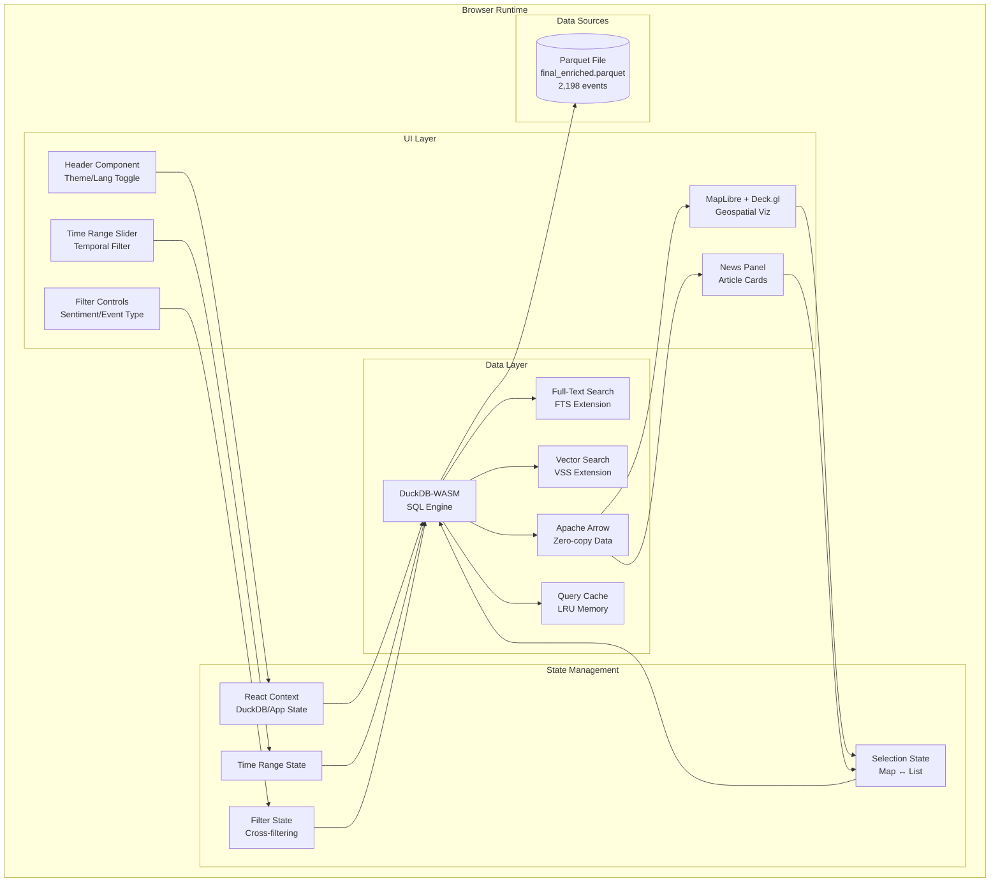
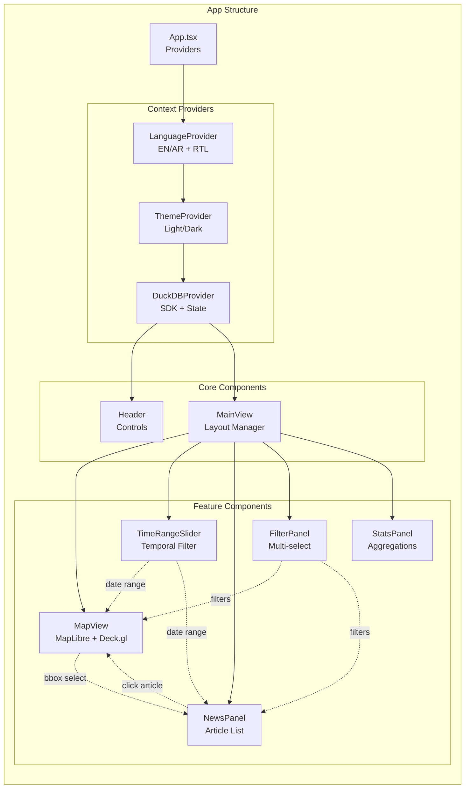
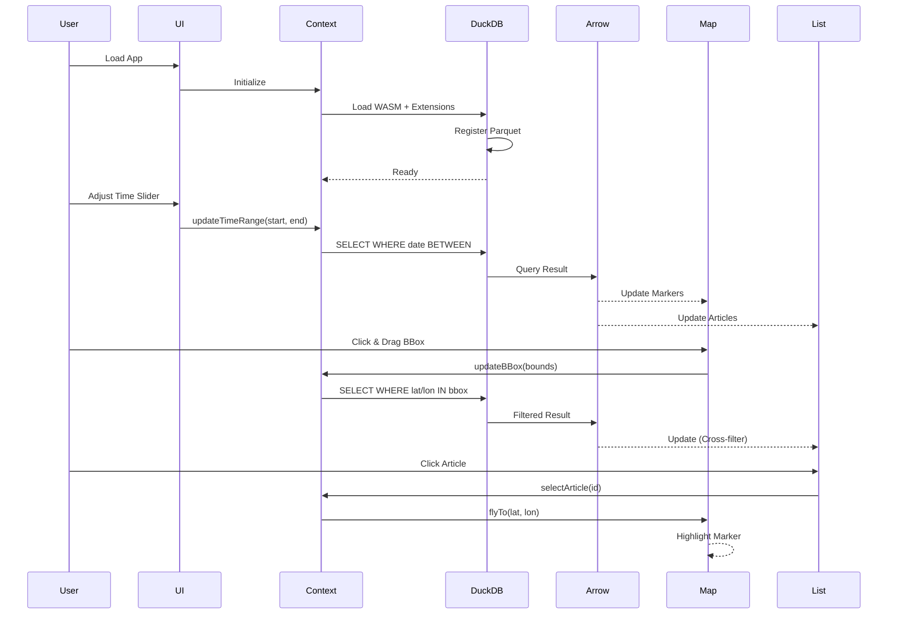
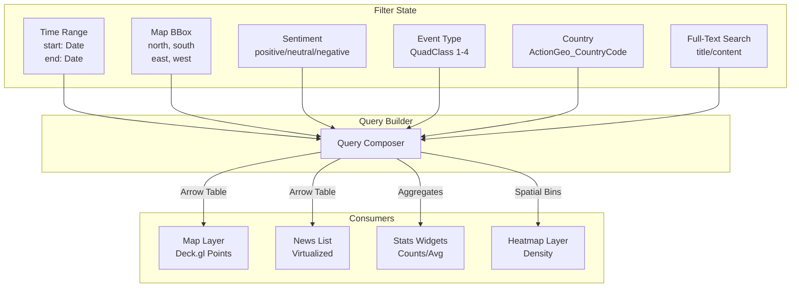
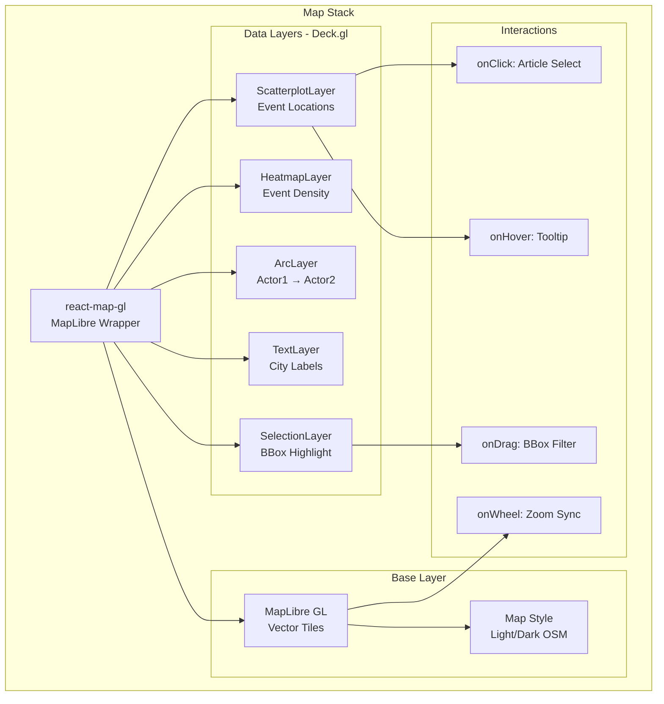
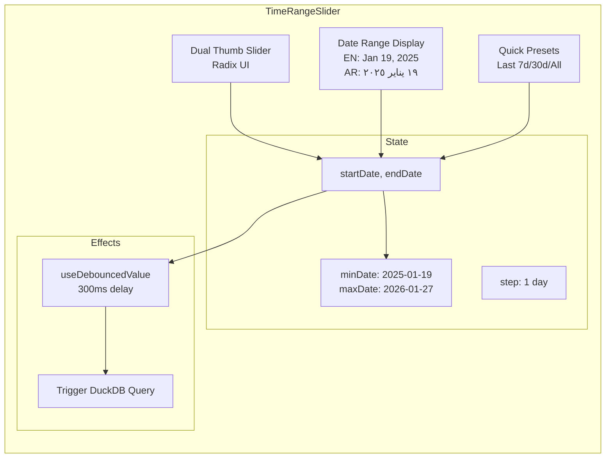
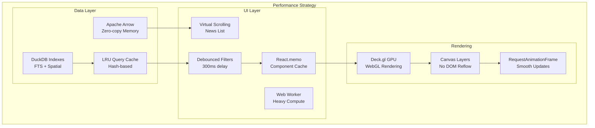

# GDELT Saudi Arabia News Panel - Architecture

## Overview

A browser-based news analysis playground for GDELT dataset using DuckDB-WASM, Apache Arrow, MapLibre GL, and Deck.gl. Zero backend, all processing in-browser.

## System Architecture



## Component Architecture



## Data Flow Architecture



## Cross-Filtering Architecture



## DuckDB Integration Pattern

```mermaid
graph TB
    subgraph "DuckDB Context Provider"
        Init[useEffect: Initialize]
        Singleton[Global DuckDB Instance<br/>Persistent across HMR]

        subgraph "Public API"
            Query[query(sql): Promise&lt;Arrow&gt;]
            FTSearch[fullTextSearch(q): Promise&lt;Results&gt;]
            Spatial[spatialFilter(bbox): Promise&lt;Results&gt;]
            Temporal[temporalFilter(range): Promise&lt;Results&gt;]
            Stats[getStats(): Promise&lt;Aggregates&gt;]
        end

        subgraph "State"
            Status[status: loading|ready|error]
            Data[cachedData: Map&lt;queryHash, Arrow&gt;]
            Filters[activeFilters: FilterState]
        end
    end

    Init --> Singleton
    Singleton --> Query
    Singleton --> FTSearch
    Singleton --> Spatial
    Singleton --> Temporal
    Singleton --> Stats

    Query --> Data
    FTSearch --> Data
    Spatial --> Data
    Temporal --> Data
```

## Map Visualization Stack



## Time Range Slider Component



## Schema & Query Patterns

### Core Table Schema
```typescript
interface GDELTEvent {
  // Identity
  GLOBALEVENTID: bigint;
  SQLDATE: number;          // YYYYMMDD

  // Temporal
  Year: number;
  MonthYear: number;
  FractionDate: number;
  DATEADDED: bigint;

  // Actors
  Actor1Name: string;
  Actor1CountryCode: string;
  Actor1Geo_Lat: number;
  Actor1Geo_Long: number;
  Actor2Name: string;
  Actor2CountryCode: string;

  // Event Classification
  EventCode: string;         // 78 unique codes
  EventBaseCode: string;
  EventRootCode: string;
  QuadClass: number;         // 1-4 (Cooperation → Conflict)
  GoldsteinScale: number;    // -10 to +10

  // Sentiment
  AvgTone: number;           // -12.64 to +14.29

  // Geography
  ActionGeo_Type: number;
  ActionGeo_FullName: string;
  ActionGeo_CountryCode: string;
  ActionGeo_Lat: number;
  ActionGeo_Long: number;

  // Article
  ArticleTitle: string;
  ArticleContent: string;
  ArticleAuthor: string;
  ArticlePublishDate: string;
  ArticleContentLength: bigint;

  // Sources
  SOURCEURL: string;
  NumSources: number;
  NumArticles: number;

  // Quality
  quality_score: number;     // 90-100
}
```

### Key Query Patterns

```sql
-- 1. Temporal + Spatial Filter
SELECT
  GLOBALEVENTID, ArticleTitle, AvgTone,
  ActionGeo_Lat as lat, ActionGeo_Long as lon,
  ActionGeo_CountryCode as country
FROM final_enriched
WHERE SQLDATE BETWEEN ? AND ?
  AND ActionGeo_Lat BETWEEN ? AND ?
  AND ActionGeo_Long BETWEEN ? AND ?
  AND AvgTone IS NOT NULL;

-- 2. Sentiment Aggregation by Country
SELECT
  ActionGeo_CountryCode as country,
  COUNT(*) as event_count,
  AVG(AvgTone) as avg_sentiment,
  AVG(GoldsteinScale) as avg_conflict_intensity,
  MIN(SQLDATE) as first_date,
  MAX(SQLDATE) as last_date
FROM final_enriched
WHERE ActionGeo_CountryCode IS NOT NULL
GROUP BY ActionGeo_CountryCode
ORDER BY event_count DESC;

-- 3. Full-Text Search with FTS Extension
CREATE INDEX IF NOT EXISTS fts_articles
ON final_enriched
USING FTS(ArticleTitle, ArticleContent);

SELECT
  GLOBALEVENTID,
  ArticleTitle,
  fts_main_final_enriched.match_bm25(
    GLOBALEVENTID, ?, fields := 'ArticleTitle,ArticleContent'
  ) as relevance_score
FROM final_enriched
WHERE relevance_score IS NOT NULL
ORDER BY relevance_score DESC
LIMIT 100;

-- 4. Time Series Aggregation
SELECT
  SQLDATE,
  COUNT(*) as events,
  AVG(AvgTone) as avg_tone,
  SUM(CASE WHEN QuadClass = 1 THEN 1 ELSE 0 END) as cooperation,
  SUM(CASE WHEN QuadClass = 4 THEN 1 ELSE 0 END) as conflict
FROM final_enriched
GROUP BY SQLDATE
ORDER BY SQLDATE;

-- 5. Actor Network Query
SELECT
  Actor1Name as source,
  Actor2Name as target,
  COUNT(*) as interaction_count,
  AVG(GoldsteinScale) as avg_intensity,
  AVG(AvgTone) as avg_sentiment
FROM final_enriched
WHERE Actor1Name IS NOT NULL
  AND Actor2Name IS NOT NULL
GROUP BY Actor1Name, Actor2Name
HAVING interaction_count > 2
ORDER BY interaction_count DESC;
```

## Technology Stack

### Core Dependencies
```json
{
  "react": "^19.2.3",
  "typescript": "^5.9.3",
  "vite": "^7.3.0",
  "tailwindcss": "^4.1.18",

  "// DuckDB Stack": "",
  "@duckdb/duckdb-wasm": "^1.30.0",
  "apache-arrow": "^18.1.0",

  "// Map Stack": "",
  "react-map-gl": "^8.1.0",
  "maplibre-gl": "^5.15.0",
  "deck.gl": "^9.1.2",
  "@deck.gl/layers": "^9.1.2",
  "@deck.gl/geo-layers": "^9.1.2",

  "// UI Components": "",
  "@radix-ui/react-slider": "^1.2.0",
  "@radix-ui/react-select": "^2.1.1",
  "@radix-ui/react-tabs": "^1.1.0",
  "lucide-react": "^0.562.0",
  "sonner": "^2.0.7",

  "// Utilities": "",
  "class-variance-authority": "^0.7.1",
  "tailwind-merge": "^3.4.0",
  "date-fns": "^4.1.0"
}
```

## Performance Optimizations



## Key Features

### 1. **Cross-Filtering**
- Time slider updates both map and list
- Map bbox selection filters article list
- Article selection flies to location on map
- Filter panel applies to all views simultaneously

### 2. **Real-time Interactions**
- Click article → map flies to location + highlight
- Drag map bbox → list filters to visible articles
- Adjust time slider → all views update with debounce
- Hover marker → show tooltip with article preview

### 3. **Sentiment Visualization**
- Color-coded markers (green=positive, red=negative, gray=neutral)
- Heatmap layer showing event density
- Sentiment trend chart over time
- Country-level sentiment aggregation

### 4. **Internationalization**
- English + Arabic (RTL support)
- Date formatting per locale
- Number formatting (Arabic-Indic numerals)
- Font switching (Inter → Cairo/Tajawal)

### 5. **Theme Support**
- Light/Dark mode with OKLch colors
- Map style switches with theme
- Persistent preference in localStorage
- System preference detection

## File Structure

```
GDELT-SA-playground/
├── src/
│   ├── components/
│   │   ├── ui/                    # shadcn/ui primitives
│   │   ├── Header.tsx             # Theme/lang controls
│   │   ├── MapView.tsx            # MapLibre + Deck.gl
│   │   ├── TimeRangeSlider.tsx    # Temporal filter
│   │   ├── NewsPanel.tsx          # Article list
│   │   ├── FilterPanel.tsx        # Multi-select filters
│   │   └── StatsPanel.tsx         # Aggregate metrics
│   ├── context/
│   │   ├── duckdb-context.tsx     # DuckDB SDK provider
│   │   ├── app-state-context.tsx  # Selection/filter state
│   │   └── i18n-context.tsx       # Language provider
│   ├── hooks/
│   │   ├── use-theme.ts           # Theme management
│   │   ├── use-duckdb-query.ts    # Query hook
│   │   └── use-cross-filter.ts    # Filter coordination
│   ├── lib/
│   │   ├── duckdb-client.ts       # DuckDB initialization
│   │   ├── query-builder.ts       # SQL generation
│   │   └── utils.ts               # Helpers
│   ├── types/
│   │   ├── gdelt.ts               # GDELT types
│   │   └── filters.ts             # Filter types
│   ├── i18n/
│   │   ├── en.json                # English translations
│   │   └── ar.json                # Arabic translations
│   ├── App.tsx                    # Root component
│   ├── main.tsx                   # Entry point
│   └── index.css                  # Global styles
├── public/
│   └── data/
│       └── final_enriched.parquet # GDELT dataset
├── vite.config.ts
├── package.json
├── tsconfig.json
└── components.json                # shadcn/ui config
```

## Deployment

- **Host**: GitHub Pages with custom domain
- **Build**: Vite static build
- **CDN**: Parquet file served from same origin
- **Analytics**: PostHog (optional)

## Dataset Summary

- **Size**: 1.9 MB parquet
- **Records**: 2,198 events
- **Date Range**: Jan 19, 2025 - Jan 27, 2026
- **Countries**: 35 unique
- **Event Types**: 78 unique codes
- **Quality Score**: 90-100 (avg: 98.56)
