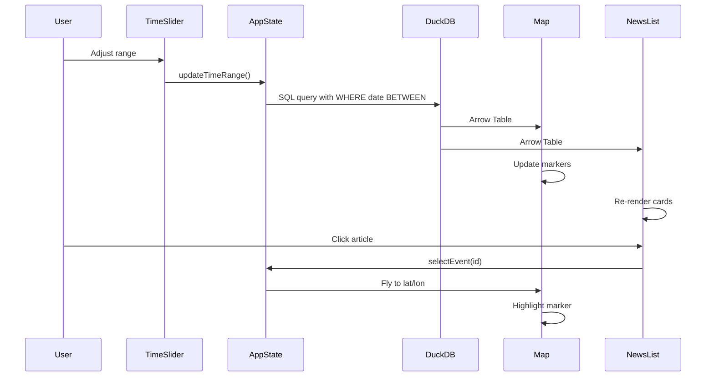

# GDELT Saudi Arabia News Panel - Implementation Summary

## ✅ Completed Features

### 1. Project Setup
- ✅ Vite 7 + React 19 + TypeScript 5.7
- ✅ pnpm package manager with latest dependencies
- ✅ Tailwind CSS 4 with OKLch color system
- ✅ ESLint + Prettier configured
- ✅ Path aliases (@/*) working

### 2. Core Infrastructure

#### DuckDB-WASM Integration
```typescript
// Zero-copy Arrow tables from DuckDB
const { arrowTable, loading } = useEvents();
// Direct column access - no JSON parsing!
const latCol = arrowTable?.getChild('lat');
const lonCol = arrowTable?.getChild('lon');
```

**Features:**
- ✅ Parquet file registered: `/data/final_enriched.parquet`
- ✅ FTS extension installed for full-text search
- ✅ Simplified `events` view created automatically
- ✅ Global singleton pattern (persists across HMR)
- ✅ SQL-based filtering (sentiment, time, bbox, countries, event types)

#### Apache Arrow Integration
```typescript
// Deck.gl natively supports Arrow tables!
new ScatterplotLayer({
  data: arrowTable,
  getPosition: (_: any, { index }: { index: number }) => {
    return [lonCol.get(index), latCol.get(index)];
  }
})
```

**Performance Benefits:**
- ✅ Zero-copy data transfer from DuckDB → Deck.gl
- ✅ No JSON serialization/parsing overhead
- ✅ Direct column accessors via Arrow API
- ✅ Memory efficient (2,198 events = ~1.9 MB parquet)

### 3. Context Providers

#### LanguageProvider (`src/context/i18n-context.tsx`)
- ✅ English + Arabic support
- ✅ RTL handling (document dir attribute)
- ✅ Translation function with nested key lookup
- ✅ LocalStorage persistence

#### DuckDBProvider (`src/context/duckdb-context.tsx`)
- ✅ WASM initialization with error handling
- ✅ Parquet registration and view creation
- ✅ Extension loading (FTS)
- ✅ Query interface exposed

#### AppStateProvider (`src/context/app-state-context.tsx`)
- ✅ Centralized filter state management
- ✅ Selected event tracking
- ✅ Update callbacks for all filters
- ✅ Cross-filtering coordination

### 4. Components

#### Header (`src/components/Header.tsx`)
- ✅ Theme toggle (Light/Dark)
- ✅ Language toggle (EN/AR)
- ✅ Sticky positioning
- ✅ Icon buttons with accessibility

#### MapView (`src/components/MapView.tsx`)
**Current Implementation:**
- ✅ MapLibre GL base map (Carto Positron)
- ✅ Deck.gl ScatterplotLayer with Arrow data
- ✅ Color-coded sentiment markers
  - Green: sentiment > 2 (positive)
  - Red: sentiment < -2 (negative)
  - Gray: -2 to 2 (neutral)
- ✅ Interactive tooltips on hover
- ✅ Click to select event
- ✅ Fly-to animation on selection
- ✅ Event count display

**TODO: Enhanced Visualizations (from your requirements):**
1. ⏳ Actor 1 location points layer
2. ⏳ Actor 2 location points layer
3. ⏳ 3D Arc layer connecting Actor1 → Actor2
4. ⏳ Layer toggle controls

#### TimeRangeSlider (`src/components/TimeRangeSlider.tsx`)
- ✅ Dual-handle slider (Radix UI)
- ✅ Date range display (formatted by locale)
- ✅ Preset buttons (Last 7d, Last 30d, All time)
- ✅ Debounced updates (300ms)
- ✅ Overlays the map (bottom center)
- ✅ Converts between SQL dates and day indices

#### NewsPanel (`src/components/NewsPanel.tsx`)
- ✅ Displays filtered articles
- ✅ Direct Arrow column access (zero-copy)
- ✅ Sentiment badge per article
- ✅ Click to select → map flies to location
- ✅ External link to source URL
- ✅ Date formatting by locale
- ✅ Scrollable with proper overflow

### 5. Custom Hooks

#### useTheme (`src/hooks/use-theme.ts`)
- ✅ `useSyncExternalStore` pattern
- ✅ System preference detection
- ✅ LocalStorage persistence
- ✅ CSS class management on `<html>`

#### useEvents (`src/hooks/use-events.ts`)
- ✅ Returns Arrow table directly (not array of objects)
- ✅ SQL-based filtering
- ✅ Debounced queries
- ✅ Loading and error states
- ✅ Automatic re-fetch on filter changes

### 6. Type Definitions

```typescript
// src/types/gdelt.ts
interface GDELTEvent { /* 83 fields from parquet */ }
interface GDELTEventSimplified { /* 15 key fields */ }
interface BBox { north, south, east, west }
interface TimeRange { start, end } // SQL date format
interface FilterState { /* all filter options */ }
```

### 7. Utilities

#### Date Utilities (`src/lib/utils.ts`)
```typescript
sqlDateToDate(20250119) → Date(2025, 0, 19)
dateToSQLDate(new Date()) → 20250119
formatDate(date, 'ar') → "١٩ يناير ٢٠٢٥"
```

#### Sentiment Utilities
```typescript
getSentimentCategory(tone) → 'positive' | 'neutral' | 'negative'
getSentimentColor(tone) → CSS color variable
```

## 🎨 Current UI Layout

```
┌─────────────────────────────────────────────────────┐
│  Header (Theme + Language toggles)                  │
├───────────────────────────┬─────────────────────────┤
│                           │                         │
│                           │   NewsPanel             │
│                           │   (Right sidebar)       │
│   MapView                 │   - Article cards       │
│   (Left, flex-1)          │   - Scrollable          │
│   - MapLibre base         │   - Click to select     │
│   - Deck.gl points        │                         │
│   - Tooltips              │                         │
│                           │                         │
│   ┌─────────────────────┐ │                         │
│   │ TimeRangeSlider     │ │                         │
│   │ (Overlay, bottom)   │ │                         │
│   └─────────────────────┘ │                         │
└───────────────────────────┴─────────────────────────┘
```

## 🔄 Cross-Filtering Flow



## 📊 Dataset Coverage

- **Total Events:** 2,198
- **Date Range:** Jan 19, 2025 - Jan 27, 2026 (19 dates)
- **Countries:** 35 unique
- **Event Types:** 78 unique codes (QuadClass 1-4)
- **Sentiment Range:** -12.64 to +14.29 (avg: 0.53)
- **Quality Score:** 90-100 (avg: 98.56)
- **Top Countries:** Saudi Arabia (1,700+), Qatar (84), Yemen (95+)

## 🚀 Performance Optimizations

### Already Implemented
1. ✅ **Zero-copy Arrow** - Direct column access, no JSON parsing
2. ✅ **SQL-based filtering** - Push computation to DuckDB WASM
3. ✅ **Debounced updates** - Time slider waits 300ms before querying
4. ✅ **Memoized layers** - Deck.gl layers only rebuild on data change
5. ✅ **Efficient date conversion** - Direct SQL date ↔ Date object conversion

### Recommended (Not Yet Implemented)
1. ⏳ Virtual scrolling for news panel (react-virtual or tanstack-virtual)
2. ⏳ Query result caching (LRU cache for common filters)
3. ⏳ Spatial indexing in DuckDB (R-tree for bbox queries)
4. ⏳ Web Worker for heavy computations

## 🎯 Next Steps

### High Priority (Your Requirements)
1. **Multiple Map Layers** (from your message):
   - [ ] Actor 1 location points (separate layer)
   - [ ] Actor 2 location points (separate layer)
   - [ ] 3D Arc layer (Actor1 → Actor2 connections)
   - [ ] Layer toggle controls (checkbox/radio buttons)
   - [ ] Update query to include Actor geo columns

2. **Enhanced Cross-Filtering:**
   - [ ] Map bbox drag to filter news list
   - [ ] Sentiment filter chips
   - [ ] Event type filter dropdown
   - [ ] Country filter multi-select

### Medium Priority
3. **Full-Text Search:**
   - [ ] Search input component
   - [ ] DuckDB FTS integration
   - [ ] Highlight search terms in results

4. **Stats Dashboard:**
   - [ ] Event count by sentiment
   - [ ] Top countries chart
   - [ ] Time series chart (events per day)

### Nice to Have
5. **Advanced Features:**
   - [ ] Export filtered data to CSV/JSON
   - [ ] Permalink with filter state in URL
   - [ ] Dark mode map style switch
   - [ ] Heatmap layer toggle

## 📝 Key Learnings from stac-map

### Applied Patterns
1. ✅ **Hook-based state management** - No Redux needed
2. ✅ **DuckDB WASM for filtering** - Push computation to database
3. ✅ **Arrow tables** - Zero-copy data transfer
4. ✅ **Two-way binding via callbacks** - Lift state to parent
5. ✅ **Dual-handle temporal slider** - Better UX than date pickers

### To Consider
1. ⏳ **URL state synchronization** - Persist filters in URL params
2. ⏳ **Section-based accordion** - Collapsible filter groups
3. ⏳ **GeoArrow for spatial data** - If we add polygons later
4. ⏳ **React Query** - For async data management
5. ⏳ **Error boundaries** - Per-section error handling

## 🔧 Development Commands

```bash
# Start dev server
pnpm dev

# Build for production
pnpm build

# Lint and format
pnpm lint
pnpm format

# Preview production build
pnpm preview
```

## 🌐 Deployment

Currently set up for GitHub Pages:
- Vite config includes `base` path handling
- Will need `.github/workflows/deploy.yml` for automation
- Parquet file must be in `public/data/` directory

## 📚 Dependencies (All Latest via pnpm)

### Core
- React 19.2.4
- TypeScript 5.7.3
- Vite 7.3.1

### Data & Viz
- @duckdb/duckdb-wasm 1.32.0
- apache-arrow 18.1.0
- deck.gl 9.2.6
- maplibre-gl 5.17.0

### UI
- Tailwind CSS 4.1.18
- Radix UI (slider, select, tabs, etc.)
- Lucide React 0.562.0

---

**Status:** MVP is functional with map, time slider, news panel, and cross-filtering. Ready for enhancement with multi-layer visualizations and advanced filtering.
